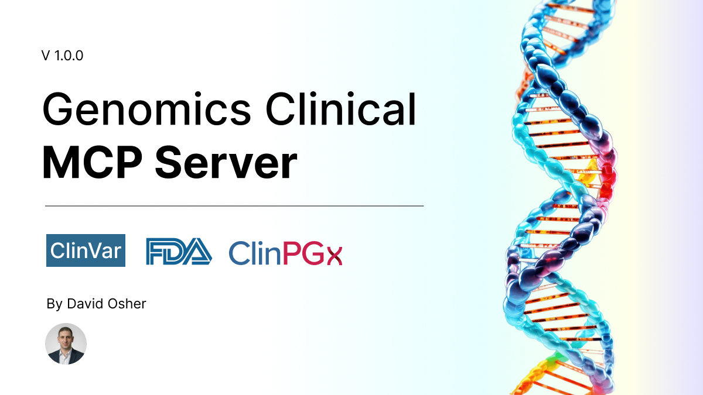

<p align="center">
  
</p>

# 🧬 Genomics Clinical MCP Server

> **MCP 2026-07-28** · Clinical genomics & pharmacogenomics decision support for AI agents  
> **Author:** [David Osher](https://github.com/DavidOsherdiagnostica) · Diagnostica

[](package.json)
[](https://modelcontextprotocol.io/specification/2026-07-28)
[](LICENSE)

Revolutionary **Model Context Protocol** server providing AI agents with clinical genomics and pharmacogenomics decision support. Integrates **ClinVar** variant pathogenicity data with **PharmGKB/ClinPGx** drug-gene interaction guidelines.

> **Sibling project:** [Israel Drugs MCP Server](https://github.com/DavidOsherdiagnostica/israel-drugs-mcp-server) — Israeli Ministry of Health pharmaceutical database

---

## ✨ Why This Server?

| Capability | Description |
|------------|-------------|
| **ClinVar Integration** | Search variants, check pathogenicity, scan genomic regions |
| **PharmGKB/ClinPGx** | Drug-gene interactions, patient risk assessment, gene-drug pairs |
| **Clinical Summary** | Integrated variant + pharmacogenomic analysis |
| **Reference Resources** | 8 static genomics references (pharmacogenes, pathogenicity guide, etc.) |
| **Clinical Prompts** | Variant interpretation, dosing review, summary templates |
| **Modern MCP** | SDK v2, OAuth 2.1, stateless HTTP, Cursor-ready |

---

## 🎯 Use Cases

- **Variant interpretation** — ACMG-style workflow with ClinVar lookup
- **Pharmacogenomic dosing** — CPIC/DPWG guidelines for warfarin, clopidogrel, etc.
- **Patient medication review** — Match genotypes to drug-gene interactions
- **Research & education** — Reference resources for gene-disease, metabolizer phenotypes

---

## 🛠 Tools

| Tool | Description |
|------|-------------|
| `clinvar_get_variant_info` | Search ClinVar by gene, rsID, HGVS, genomic location, ClinVar ID |
| `clinvar_check_pathogenicity` | Quick pathogenicity check for a variant |
| `clinvar_find_variants_in_region` | Scan genomic region for variants |
| `pharmgkb_get_drug_gene_interactions` | Comprehensive drug pharmacogenomics (CPIC, FDA labels) |
| `pharmgkb_check_patient_drug_risk` | Assess drug safety for patient genotypes |
| `pharmgkb_get_gene_drug_pairs` | Find drugs affected by a gene (ClinPGx API) |
| `genomics_clinical_summary` | Integrated clinical summary |

All tools support `concise` (human-readable) and `detailed` (full metadata) response formats.

---

## 📚 Resources

| Resource | URI | Content |
|----------|-----|---------|
| Gene-Disease Map | `genomics://gene-disease-map` | Key gene-disease associations |
| VIP Pharmacogenes | `genomics://pharmacogenes` | CYP2C9, CYP2D6, VKORC1, etc. |
| Genome Builds | `genomics://genome-builds` | GRCh37/GRCh38 reference |
| Pathogenicity Guide | `genomics://pathogenicity-guide` | ClinVar classification |
| Drug-Gene Pairs | `genomics://drug-gene-pairs` | High-priority interactions |
| Metabolizer Phenotypes | `genomics://metabolizer-phenotypes` | PM, IM, NM, RM definitions |
| Variant Nomenclature | `genomics://variant-nomenclature` | HGVS, rsID formats |
| Testing Indications | `genomics://testing-indications` | When to order PGx testing |

---

## 🚀 Quick Start

### Prerequisites

- **Node.js 20+**
- **npm**
- Internet (ClinVar, ClinPGx APIs)

### Installation

```bash
git clone https://github.com/DavidOsherdiagnostica/genomics-clinical-mcp-server.git
cd genomics-clinical-mcp-server
npm install
npm run build
cp .env.example .env   # optional
```

### Cursor (stdio — recommended for local)

Create `.cursor/mcp.json` locally (not committed to the repo):

```json
{
  "mcpServers": {
    "genomics-clinical": {
      "type": "stdio",
      "command": "node",
      "args": ["dist/index.js"],
      "cwd": "${workspaceFolder}",
      "envFile": "${workspaceFolder}/.env"
    }
  }
}
```

Enable in **Cursor Settings → MCP**, then restart Cursor.

### Claude Desktop

```json
{
  "mcpServers": {
    "genomics-clinical": {
      "command": "node",
      "args": ["/path/to/genomics-clinical-mcp-server/dist/index.js"]
    }
  }
}
```

### HTTP (remote / Docker)

```bash
npm run start:http
# Server: http://127.0.0.1:3000/mcp
# Health:  http://127.0.0.1:3000/health
```

### Docker

```bash
docker build -t genomics-clinical-mcp .
docker run -p 8080:8080 genomics-clinical-mcp
```

---

## ⚙️ Configuration

See `.env.example` for all options. Key variables:

| Variable | Default | Description |
|----------|---------|-------------|
| `CLINVAR_BASE_URL` | NCBI E-utilities | ClinVar API |
| `PHARMGKB_BASE_URL` | `https://api.clinpgx.org/v1` | ClinPGx (PharmGKB migrated) |
| `NCBI_API_KEY` | — | Optional, higher rate limits |
| `OAUTH_ENABLED` | `false` | Enable OAuth for HTTP |
| `OAUTH_REQUIRED` | `false` | Require Bearer token on `/mcp` |
| `HOST` | `127.0.0.1` | HTTP bind address |
| `PORT` | `3000` | HTTP port |

---

## 🔐 Security & OAuth

- **stdio mode:** No OAuth; credentials via env if needed
- **HTTP mode:** OAuth 2.1 optional; enable for production remote deployment
- **RFC 9728:** `/.well-known/oauth-protected-resource` when OAuth enabled
- **Rate limiting:** 60 req/min default on `/mcp`
- **Origin validation:** Configurable via `CORS_ORIGINS`, `ALLOWED_HOSTS`

For remote Cursor connection with OAuth:

```json
{
  "mcpServers": {
    "genomics-clinical": {
      "url": "https://your-server.example.com/mcp",
      "auth": {
        "CLIENT_ID": "${env:MCP_CLIENT_ID}",
        "scopes": ["genomics:read", "genomics:tools"]
      }
    }
  }
}
```

---

## 📋 Supported Formats

- **Gene symbols:** HGNC (BRCA1, CYP2C9)
- **rsIDs:** rs9923231
- **HGVS:** NM_007294.4:c.3101_3102del
- **Genomic locations:** chr, start, end, GRCh37/GRCh38
- **ClinVar IDs:** VCV/RCV
- **Drugs:** warfarin, clopidogrel
- **Genotypes:** *1/*3, TT

---

## 🏗 Architecture

```
┌─────────────┐     stdio      ┌──────────────────────┐
│   Cursor    │◄──────────────►│  Genomics Clinical   │
│ Claude etc. │                │  MCP Server v2       │
└─────────────┘                └──────────┬───────────┘
                                          │
                    ┌─────────────────────┼─────────────────────┐
                    ▼                     ▼                     ▼
              ┌──────────┐         ┌──────────┐         ┌──────────┐
              │ ClinVar  │         │ ClinPGx  │         │ Resources│
              │ E-utils  │         │ InfoBtn  │         │ (static) │
              └──────────┘         └──────────┘         └──────────┘
```

- **SDK:** `@modelcontextprotocol/server` v2 (MCP 2026-07-28)
- **Transports:** stdio (local), Streamable HTTP (remote, stateless)
- **Entry points:** `dist/index.js` (stdio), `dist/server.js --http` (HTTP)

---

## ⚠️ Medical Disclaimer

**For research and clinical decision support only.** Not a substitute for professional medical advice, diagnosis, or treatment. Always consult qualified healthcare providers and genetic counselors.

---

## 🤝 Contributing

1. Fork the repository
2. Create a feature branch
3. Run `npm run build && npm test`
4. Submit a pull request

---

## 📄 License

[CC BY-NC-SA 4.0](LICENSE) — Attribution, NonCommercial, ShareAlike

---

## 👤 Author

**David Osher** · [GitHub](https://github.com/DavidOsherdiagnostica) · [LinkedIn](https://linkedin.com/in/davidosher)

Author of MCP connectors for Israel Gov open data and Israel MoH drug DB. Building reliable AI tooling for healthcare.

**Related projects:**
- [Israel Drugs MCP](https://github.com/DavidOsherdiagnostica/israel-drugs-mcp-server)
- [data-gov-il-mcp](https://github.com/DavidOsherdiagnostica/data-gov-il-mcp)
